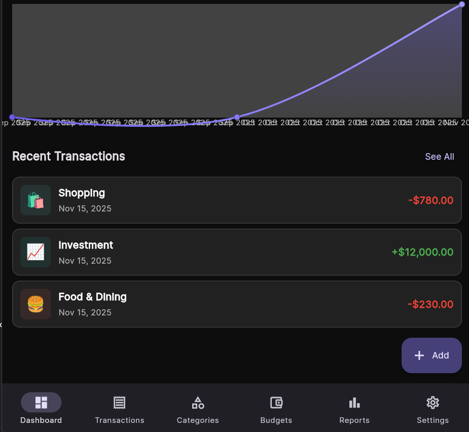
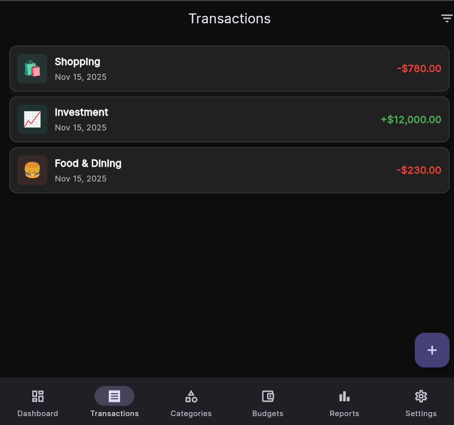

# 📸 How to Add Screenshots to GitHub Repository

## Step-by-Step Guide

### Step 1: Take Screenshots of Your App

**Screens to Capture:**
1. Login Screen
2. Dashboard (with charts and balance card)
3. Add Transaction Screen
4. Transactions List
5. Categories Screen
6. Budgets Screen
7. Reports Screen
8. Settings Screen (Light mode)
9. Settings Screen (Dark mode)

**How to Take Screenshots:**

**Option A: Using Windows Snipping Tool**
1. Press `Windows + Shift + S`
2. Select area to capture
3. Screenshot is copied to clipboard
4. Open Paint or any image editor
5. Paste (`Ctrl + V`)
6. Save as PNG

**Option B: Using Browser DevTools (for web app)**
1. Open app in browser
2. Press `F12` to open DevTools
3. Click device toolbar icon (or `Ctrl + Shift + M`)
4. Select phone size (e.g., iPhone 12 Pro)
5. Take screenshot using browser's screenshot tool

**Option C: Using Print Screen**
1. Press `Print Screen` key
2. Open Paint
3. Paste and crop
4. Save as PNG

### Step 2: Save Screenshots with Proper Names

Save your screenshots in the `screenshots` folder with these names:

```
D:\Valuify\screenshots\
├── login.png
├── dashboard.png
├── transactions.png
├── add-transaction.png
├── categories.png
├── budgets.png
├── reports.png
├── settings.png
└── dark-mode.png
```

**Naming Convention:**
- Use lowercase
- Use hyphens for spaces
- Use `.png` format (better quality)
- Keep names descriptive

### Step 3: Add Screenshots to Git

Open PowerShell in your project folder and run:

```powershell
# Add screenshots folder
git add screenshots/

# Commit
git commit -m "Add app screenshots"

# Push to GitHub
git push origin main
```

### Step 4: Verify on GitHub

1. Go to https://github.com/skulllord/Valuify
2. Click on `screenshots` folder
3. You should see all your images
4. Scroll down to README - screenshots should display!

---

## 🎨 Alternative: Create a Collage

If you want a single image with multiple screenshots:

**Using Online Tools:**
1. Go to https://www.canva.com/
2. Create a new design (1920x1080)
3. Upload your screenshots
4. Arrange them nicely
5. Download as PNG
6. Save as `screenshots/app-preview.png`

**Then update README:**
```markdown
## 📱 App Preview

<div align="center">
  
</div>
```

---

## 📐 Recommended Screenshot Sizes

For best display on GitHub:

- **Individual screenshots**: 400-600px width
- **Collage/Banner**: 1200-1920px width
- **Format**: PNG (better quality than JPG)
- **File size**: Keep under 1MB each

---

## 🎯 Pro Tips

### 1. Use Consistent Styling
- Same device frame for all screenshots
- Same background color
- Same zoom level

### 2. Show Key Features
- Dashboard with data (not empty)
- Charts with actual data
- Filled forms (not blank)

### 3. Add Captions
Update README with descriptions:

```markdown
### 📊 Dashboard


View your financial overview with animated balance cards and interactive charts.

### 💰 Transactions


Manage all your income and expenses with swipe-to-delete functionality.
```

### 4. Create a GIF Demo (Optional)

**Using ScreenToGif (Windows):**
1. Download from https://www.screentogif.com/
2. Record your app in action
3. Save as GIF
4. Add to README:

```markdown
## 🎬 Demo

<div align="center">
  
</div>
```

---

## 📝 Quick Commands

```powershell
# Create screenshots folder (already done)
mkdir screenshots

# Add all screenshots
git add screenshots/

# Commit with message
git commit -m "Add app screenshots"

# Push to GitHub
git push origin main

# Check status
git status
```

---

## ✅ Checklist

- [ ] Take screenshots of all major screens
- [ ] Save in `screenshots` folder with proper names
- [ ] Optimize image sizes (under 1MB each)
- [ ] Add to git: `git add screenshots/`
- [ ] Commit: `git commit -m "Add screenshots"`
- [ ] Push: `git push origin main`
- [ ] Verify on GitHub
- [ ] Check README displays correctly

---

## 🎉 Result

Once done, your GitHub repository will have:
- Professional-looking README
- Visual preview of your app
- Better presentation for potential users/employers
- Increased engagement and stars ⭐

---

## 🆘 Troubleshooting

**Screenshots not showing on GitHub?**
- Check file paths are correct
- Ensure files are committed and pushed
- Wait a few seconds for GitHub to process
- Try hard refresh: `Ctrl + Shift + R`

**Images too large?**
- Use online compressor: https://tinypng.com/
- Or resize in Paint/Photoshop
- Keep under 1MB per image

**Want to update screenshots?**
```powershell
# Replace old screenshots
# Then:
git add screenshots/
git commit -m "Update screenshots"
git push origin main
```

---

**Need help?** Just ask! 🚀
