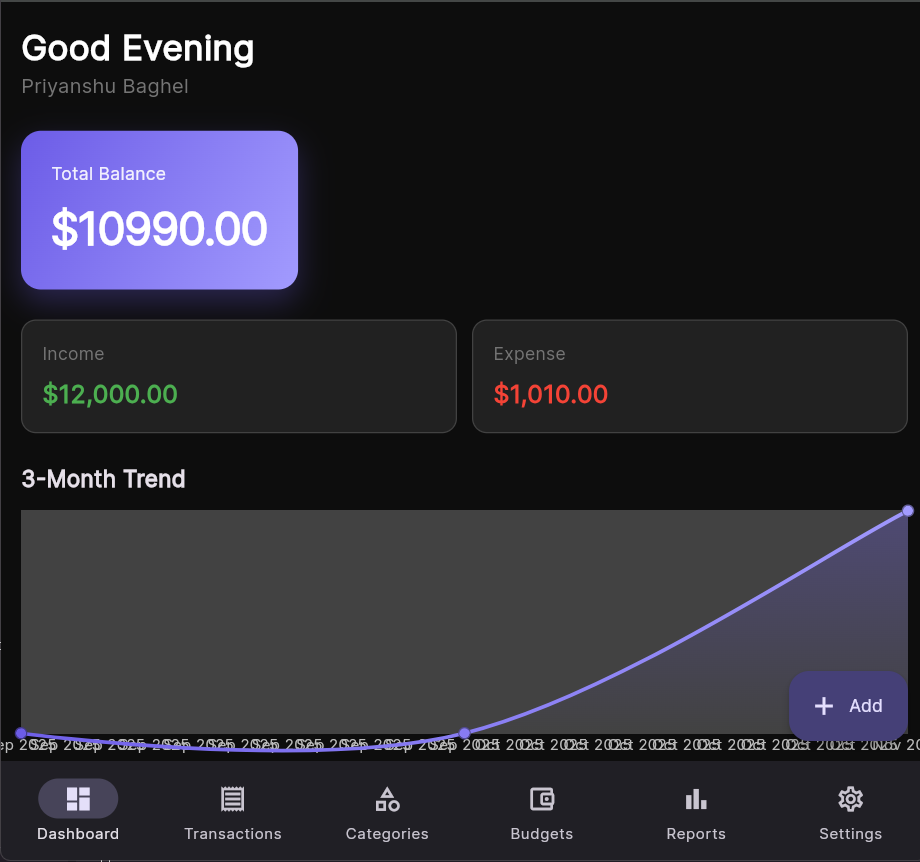
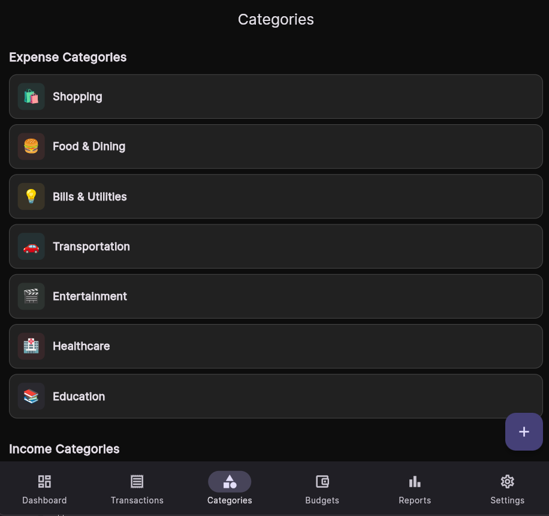
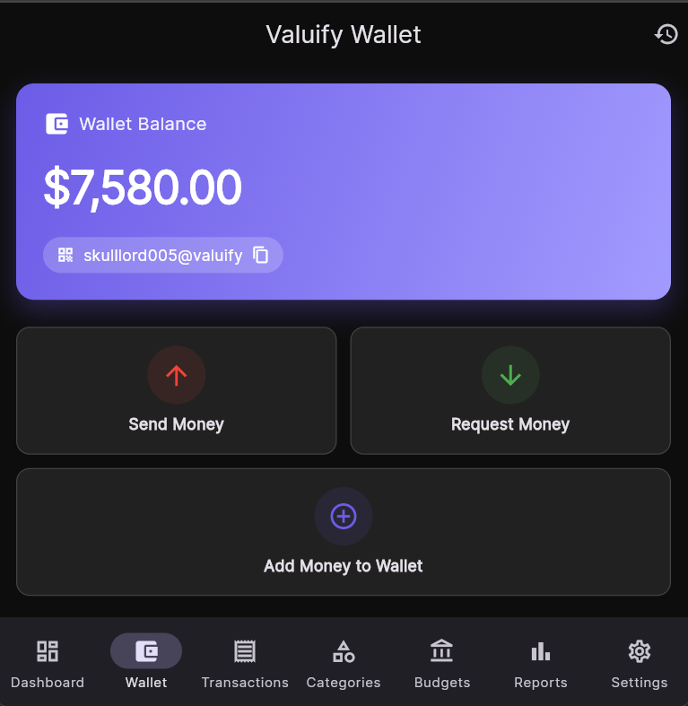
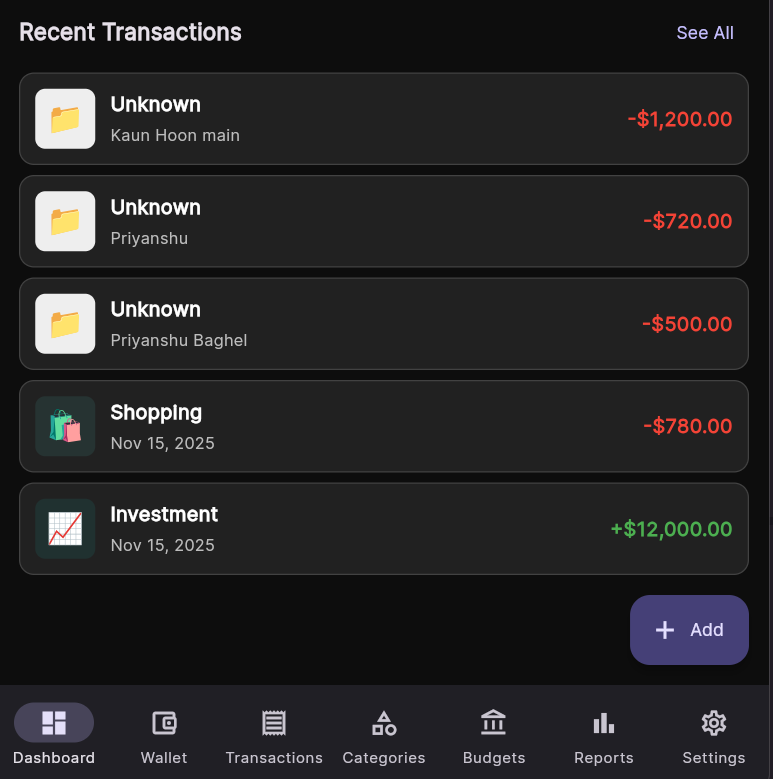
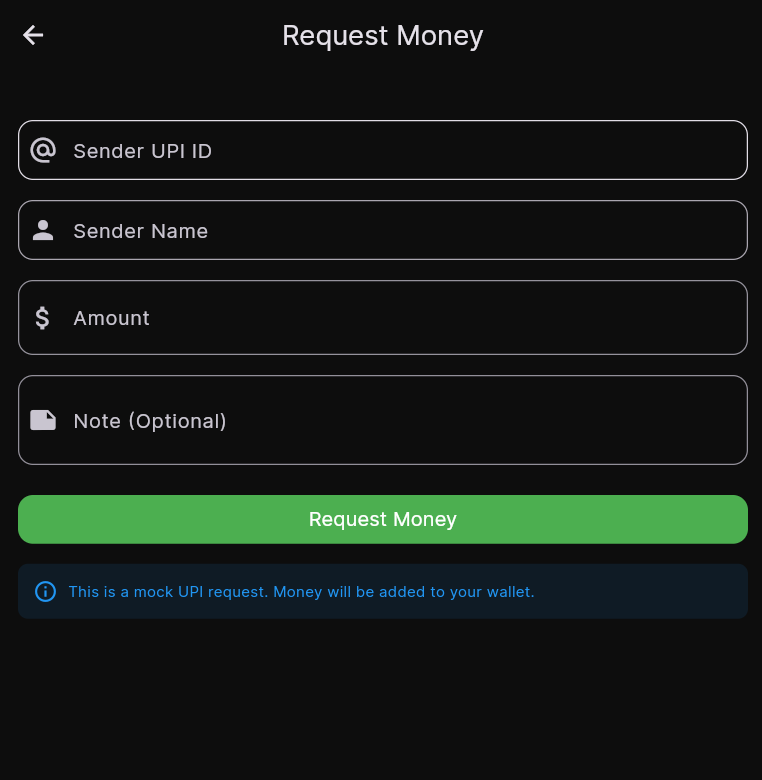
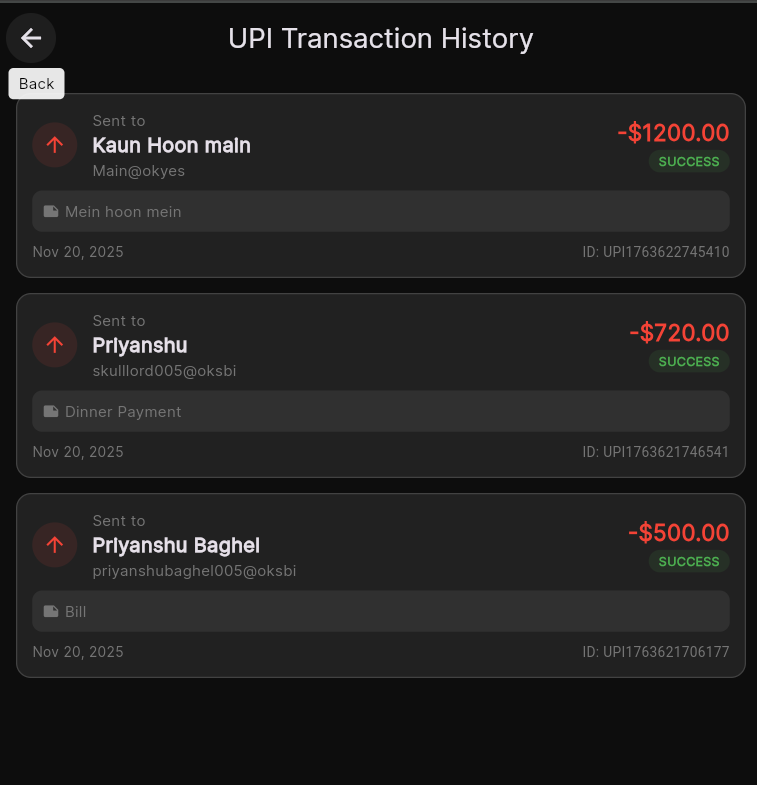
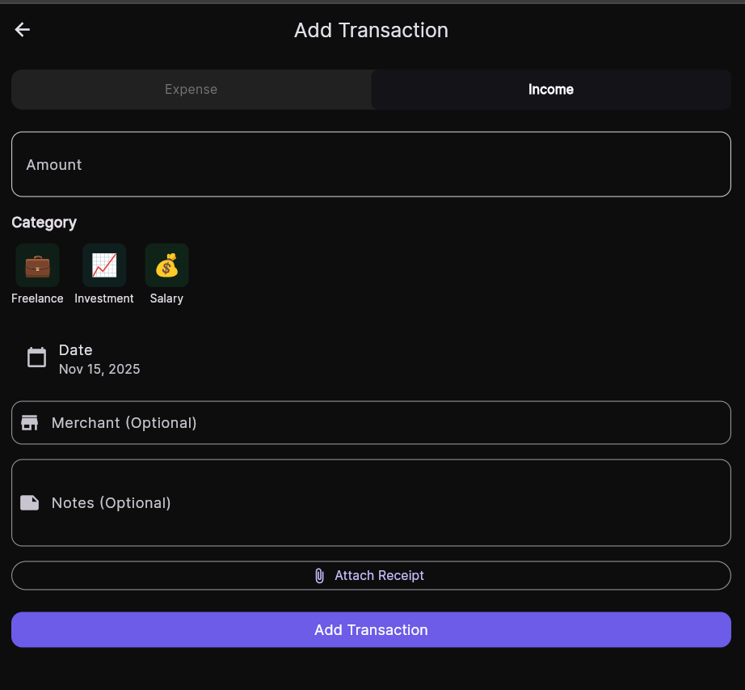
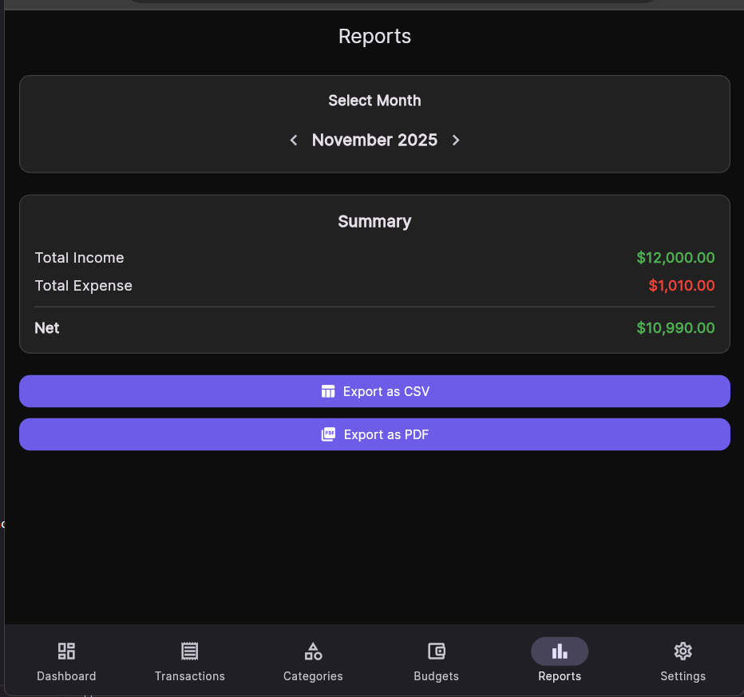

# Valuify - Personal Finance Tracker

A premium, CRED-style personal finance app built with Flutter.

<div align="center">
  
  
  
  
</div>

---

## 📱 Screenshots

### Core Features
<div align="center">
  
  
  
  
</div>

### 💰 UPI Wallet & Payments (NEW!)
<div align="center">
  
  
  
  
</div>

### More Features
<div align="center">
  
  
  
  
</div>

---

## ✨ Features

- 🔐 Authentication (Email/Password + Google Sign-In)
- 💰 Dashboard with animated balance cards
- 📊 Interactive charts (3-month trend, category pie chart)
- 💳 Transaction management (CRUD with receipt photos)
- 🏷️ Custom categories with icons and colors
- 💵 Monthly budgets with progress tracking
- 📈 Reports (CSV export, PDF generation)
- 💸 **UPI Wallet & Mock Payments** (NEW!)
  - Mock wallet with starting balance
  - Send/receive money via UPI
  - Transaction history
  - Real-time balance updates
- ⚙️ Settings (currency, theme, biometric lock)

## Setup Instructions

### Prerequisites

1. Install Flutter SDK (3.x or higher)
2. Install Android Studio / Xcode
3. Set up Firebase project

### Firebase Setup

1. Go to [Firebase Console](https://console.firebase.google.com/)
2. Create a new project named "Valuify"
3. Enable the following services:
   - Authentication (Email/Password + Google)
   - Cloud Firestore
   - Firebase Storage

4. **For Android:**
   - Download `google-services.json`
   - Place it in `android/app/`

5. **For iOS:**
   - Download `GoogleService-Info.plist`
   - Place it in `ios/Runner/`

### Installation

```bash
# Clone the repository
git clone https://github.com/skulllord/Valuify.git
cd Valuify

# Install dependencies
flutter pub get

# Run the app
flutter run
```

### Build APK

```bash
# Debug APK
flutter build apk --debug

# Release APK
flutter build apk --release

# APK location: build/app/outputs/flutter-apk/
```

## Project Structure

```
lib/
├── main.dart
├── screens/
│   ├── auth/
│   │   ├── login_screen.dart
│   │   └── register_screen.dart
│   ├── dashboard/
│   │   └── dashboard_screen.dart
│   ├── transactions/
│   │   ├── transactions_screen.dart
│   │   └── add_transaction_screen.dart
│   ├── categories/
│   │   └── categories_screen.dart
│   ├── budgets/
│   │   └── budgets_screen.dart
│   ├── reports/
│   │   └── reports_screen.dart
│   └── settings/
│       └── settings_screen.dart
├── widgets/
│   ├── balance_card.dart
│   ├── transaction_item.dart
│   ├── category_icon.dart
│   └── chart_widgets.dart
├── models/
│   ├── user_model.dart
│   ├── transaction_model.dart
│   ├── category_model.dart
│   └── budget_model.dart
├── services/
│   ├── auth_service.dart
│   ├── firestore_service.dart
│   ├── storage_service.dart
│   └── pdf_service.dart
├── providers/
│   ├── auth_provider.dart
│   ├── transaction_provider.dart
│   ├── category_provider.dart
│   ├── budget_provider.dart
│   └── theme_provider.dart
└── utils/
    ├── constants.dart
    ├── colors.dart
    └── helpers.dart
```

## Firestore Structure

```
users/{userId}
  ├── accounts/{accountId}
  ├── categories/{categoryId}
  ├── transactions/{txnId}
  ├── budgets/{budgetId}
  └── settings
```

## Tech Stack

- **Framework:** Flutter 3.x
- **State Management:** Riverpod
- **Backend:** Firebase (Auth, Firestore, Storage)
- **Charts:** FL Chart
- **Authentication:** Firebase Auth + Google Sign-In

## License

MIT License
